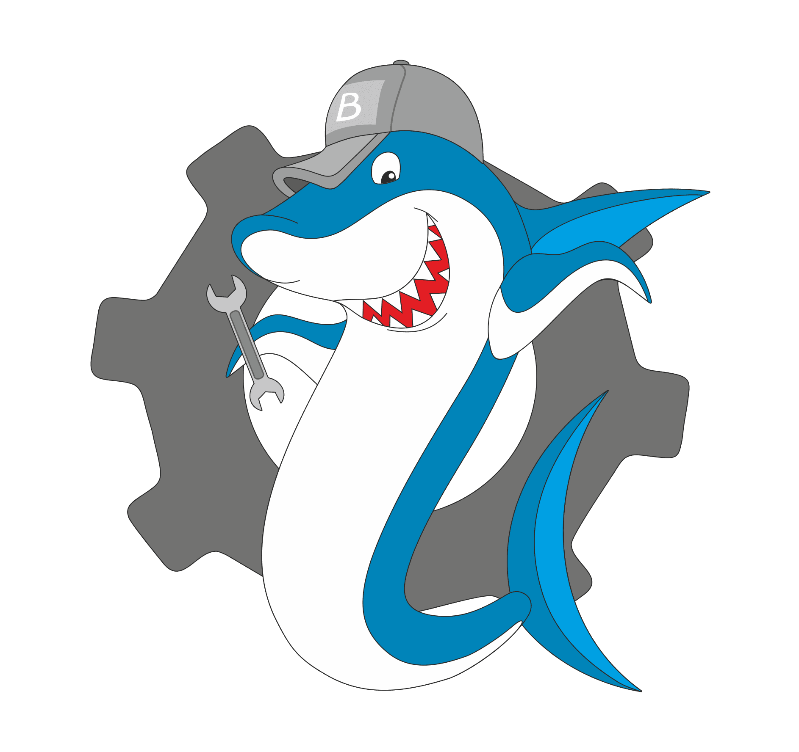

<!--
*** Thanks for checking out this README Template. If you have a suggestion that would
*** make this better, please fork the repo and create a pull request or simply open
*** an issue with the tag "enhancement".
*** Thanks again! Now go create something AMAZING! :D
***
***
***
*** To avoid retyping too much info. Do a search and replace for the following:
*** github_username, repo, twitter_handle, email
-->


<!-- PROJECT SHIELDS -->
<!--
*** I'm using markdown "reference style" links for readability.
*** Reference links are enclosed in brackets [ ] instead of parentheses ( ).
*** See the bottom of this document for the declaration of the reference variables
*** for contributors-url, forks-url, etc. This is an optional, concise syntax you may use.
*** https://www.markdownguide.org/basic-syntax/#reference-style-links
-->
[![Contributors][contributors-shield]][contributors-url]
[![Forks][forks-shield]][forks-url]
[![Stargazers][stars-shield]][stars-url]
[![Issues][issues-shield]][issues-url]
[![MIT License][license-shield]][license-url]
[![LinkedIn][linkedin-shield]][linkedin-url]
[](https://app.netlify.com/sites/objective-payne-ff1c8b/deploys)
[](https://wakatime.com/badge/github/Bimbalacom/Website)


<!-- PROJECT LOGO -->
<br />
<p align="center">
  <a href="https://github.com/Bimbalacom/Website">
    
  </a>

  <h3 align="center">Bimbala website</h3>

  <p align="center">
    Here you can find the source code of our official website.
    <br />
    <br />
    <a href="https://bimbala.com">View Demo</a>
    ·
    <a href="https://github.com/Bimbalacom/Website/issues/new?assignees=&labels=bug&template=bug_report.md&title=">Report Bug</a>
    ·
    <a href="https://github.com/Bimbalacom/Website/issues/new?assignees=&labels=enhancement&template=feature_request.md&title=">Request Feature</a>
  </p>
</p>


<!-- TABLE OF CONTENTS -->
## Table of Contents

- [Table of Contents](#table-of-contents)
- [About The Project](#about-the-project)
  - [Built With](#built-with)
- [Getting Started](#getting-started)
  - [Prerequisites](#prerequisites)
  - [Installation](#installation)
- [Roadmap](#roadmap)
- [Contributing](#contributing)
- [Release plan of the website](#release-plan-of-the-website)
- [License](#license)
- [Contact](#contact)
- [Acknowledgements](#acknowledgements)


<!-- ABOUT THE PROJECT -->
## About The Project

[![Bimbala Screen Shot][product-screenshot]](https://bimbala.com)

### Built With

* [nextjs](https://nextjs.org/)


<!-- GETTING STARTED -->
## Getting Started

To get a local copy up and running follow these simple steps.

### Prerequisites

We mainly only use NextJS and plugin/extensions for it. So you can use NPM for everything.
```sh
npm install npm@latest -g
```

### Installation
 
1. Clone the repo
```sh
git clone https://github.com/Bimbalacom/Website.git
```
2. Install NPM packages
```sh
npm install
```


<!-- ROADMAP -->
## Roadmap

See the [open issues](https://github.com/Bimbalacom/Website/issues) for a list of proposed features (and known issues).


<!-- CONTRIBUTING -->
## Contributing

Contributions are what make the open source community such an amazing place to be learn, inspire, and create. Any contributions you make are **greatly appreciated**.

1. Fork the Project
2. Create your Feature Branch (`git checkout -b feature/AmazingFeature`)
3. Commit your Changes (`git commit -m 'Add some AmazingFeature'`)
4. Push to the Branch (`git push origin feature/AmazingFeature`)
5. Open a Pull Request

<!-- RELEASE PLAN OF THE WEBSITE-->
## Release plan of the website

- A major version is being published each year.
- Every 3-4 weeks a new version is being released.

<!-- LICENSE -->
## License

Distributed under the MIT License. See `LICENSE` for more information.


<!-- CONTACT -->
## Contact

Our Twitter - [@bimbalacom](https://twitter.com/bimbalacom)


<!-- ACKNOWLEDGEMENTS -->
## Acknowledgements


<!-- MARKDOWN LINKS & IMAGES -->
<!-- https://www.markdownguide.org/basic-syntax/#reference-style-links -->
[contributors-shield]: https://img.shields.io/github/contributors/Bimbalacom/Website.svg?style=flat-square
[contributors-url]: https://github.com/Bimbalacom/Website/graphs/contributors
[forks-shield]: https://img.shields.io/github/forks/Bimbalacom/Website.svg?style=flat-square
[forks-url]: https://github.com/Bimbalacom/Website/network/members
[stars-shield]: https://img.shields.io/github/stars/Bimbalacom/Website.svg?style=flat-square
[stars-url]: https://github.com/Bimbalacom/Website/stargazers
[issues-shield]: https://img.shields.io/github/issues/Bimbalacom/Website.svg?style=flat-square
[issues-url]: https://github.com/Bimbalacom/Website/issues
[license-shield]: https://img.shields.io/github/license/Bimbalacom/Website.svg?style=flat-square
[license-url]: https://github.com/Bimbalacom/Website/blob/master/LICENSE.txt
[linkedin-shield]: https://img.shields.io/badge/-LinkedIn-black.svg?style=flat-square&logo=linkedin&colorB=555
[linkedin-url]: https://linkedin.com/
[product-screenshot]: public/screenshot.png